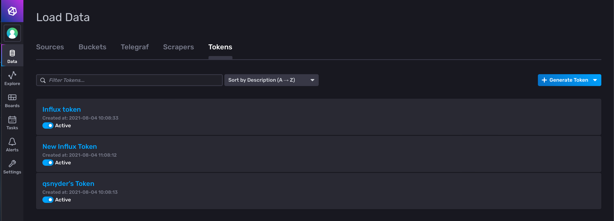
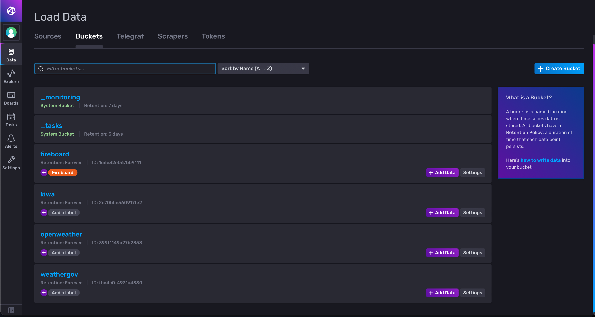
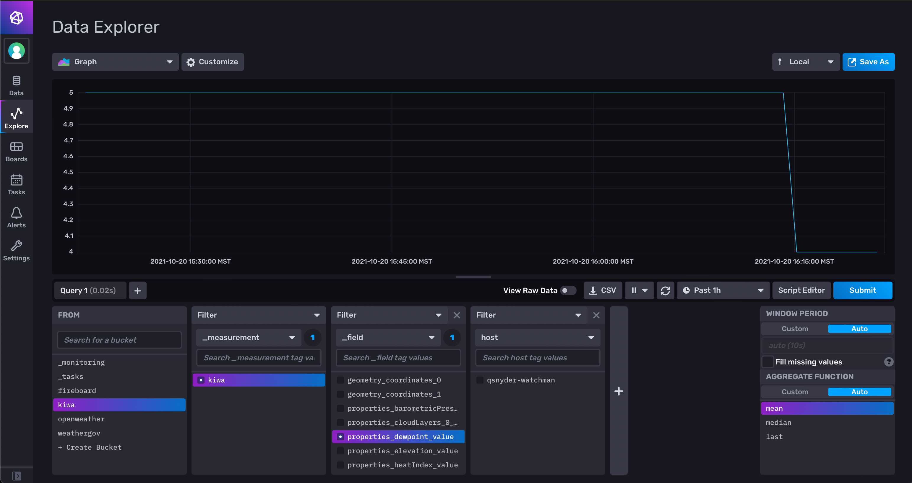
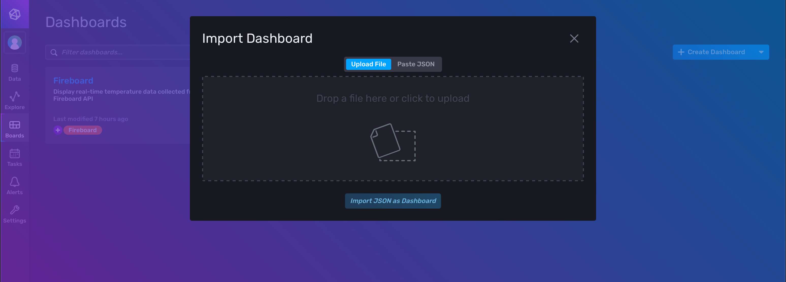
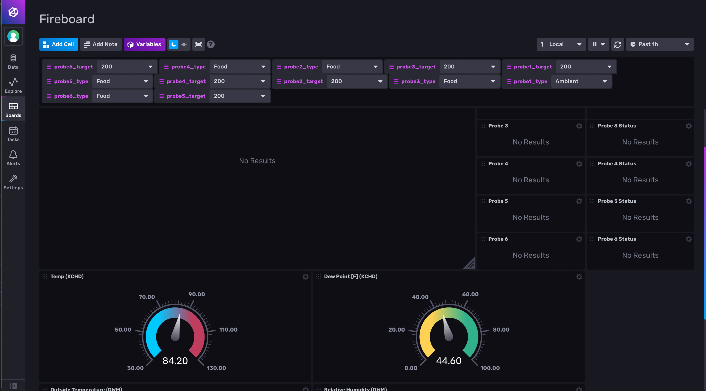
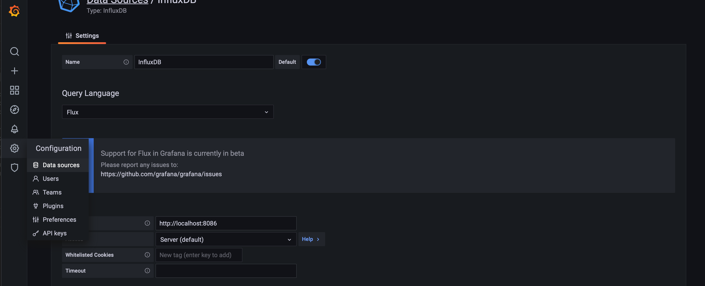
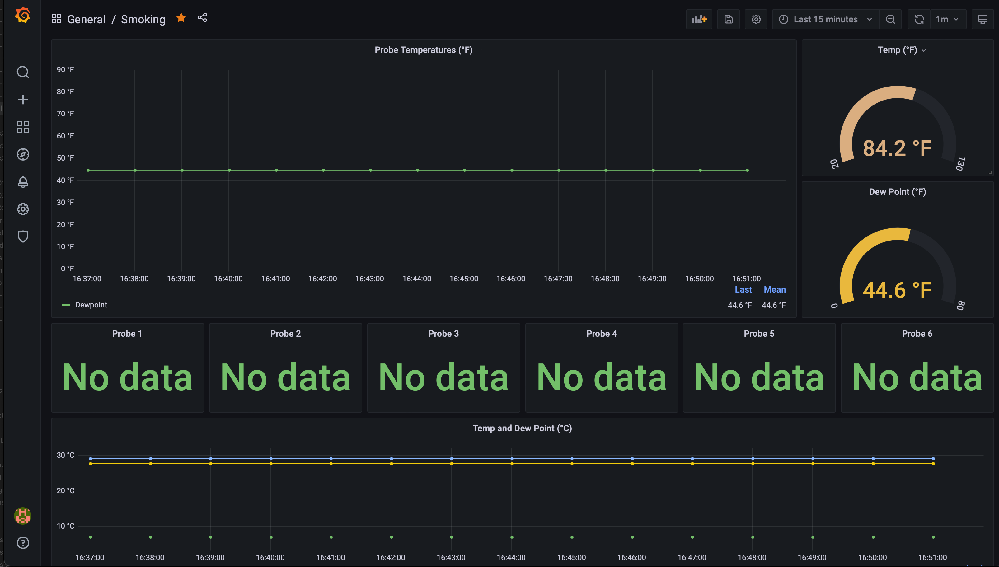
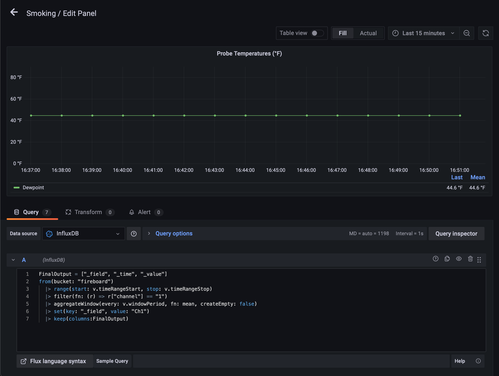

# Meat Driven Telemetry

This repository serves as a skeleton for implementing a streaming telemetry dashboard system for a BBQ smoker.  Some edits may be required/specific buckets made due to the way that the data is exported from the systems.

## Credits

Most of the original work for the InfluxDB side of integrating the Fireboard comes from [Scott Anderson](https://github.com/sanderson).
You can also find the base template that I used for the Fireboard in InfluxDB on the [influxdata GitHub organization](https://github.com/influxdata/community-templates/tree/master/fireboard)

## Prerequisites

- Fireboard v2 (any model)
- Fireboard account with API key generated (available at [fireboard.io](https://fireboard.io/))
- API key for [OpenWeatherMap](https://www.openweathermap.org), if desired
- System running telegraf,InfluxDB, and Grafana
  - Telegraf 1.19.2 (git: HEAD 3cb135b6)
  - InfluxDB 2.0.7
  - Grafana v8.0.6
- System installed on VM as applications, rather than as containers, but Docker could be used instead

## Telegraf

The telegraf.conf input file is a stripped down version of the default installed.  This version includes a direct output from my working system.  The two main sections are for **input** and **output**, which input being data being sent into telegraf and output being the data streamed out of telegraf and into some application (in our case, InfluxDB).

### Outputs

The telegraf outputs are repeated for each source.  Each output will use the same `<token>` and `<org>` values, created inside of InfluxDB.  The value for the `bucket` key will depend on what data buckets you have created and named inside of InfluxDB.  These "buckets" are partitions for your data, ensuring that different data sources are not mixed together.  Finally, the `namepass` value correlates to the name of the input data source that you wish to pass to this data bucket.

> Note: I've left the `namepass` and `name_override` values in the `telegraf.conf` file to show the correlation.  Please change these values as you see fit

If telegraf and Influx are hosted on different systems, the output URL will need to change to reflect the appropriate IP address (and port) of the remote system.

### Inputs

The inputs section contains two distinct input types -- fireboard and HTTP REST.  The Fireboard input is very straightforward, simply requiring the API token from your [fireboard.io](https://fireboard.io) account.

The HTTP inputs are responsible for querying the APIs from OpenWeatherMap and the National Weather service.  The OpenWeatherMap APIs will require both the API key generated from signing up (a free account is fine) and the station ID value for a nearby location.  These are added in the URL for the service as shown in the sample `telegraf.conf`.

> Note: OWM *does not* provide dew point data in the API, only relative humidity.  The National Weather Service has a [primer](https://www.weather.gov/arx/why_dewpoint_vs_humidity) on the differences between the two.

The [National Weather Service API](https://www.weather.gov/documentation/services-web-api#) is an open API that is very well documented and provides [JSON-LD](https://json-ld.org) returned from each query.  All that is required to bed edited in the NWS API input queries is the station that you wish to pull the data from, however, the NWS appreciates adding a "usage" or "app" value and an email address to the user-agent header to provide contact information in the event of a problem/abuse/etc.

> Note: NWS services locations mostly in the US.  There are stations outside of the US (miltary bases, etc), but this may need to be tweaked for an appropriate data provider if the NWS does not service a location near you.

### Input Testing

It is possible to test the input sources from telegraf by running the following commands:

```
telegraf --input-filter http --test
telegraf --input-filter fireboard --test
```

If configured correctly, the tests will yield output

```qsnyder@qsnyder-watchman ~> telegraf --input-filter http --test
2021-10-20T23:12:40Z I! Starting Telegraf 1.19.2
2021-10-20T23:12:40Z I! Using config file: /etc/telegraf/telegraf.conf
> kiwa,host=qsnyder-watchman,url=https://api.weather.gov/stations/KIWA/observations/latest geometry_coordinates_0=-111.66,geometry_coordinates_1=33.31,properties_barometricPressure_value=101690,properties_cloudLayers_0_base_value=6100,properties_dewpoint_value=5,properties_elevation_value=421,properties_heatIndex_value=27.510547983678332,properties_relativeHumidity_value=21.793154294904,properties_temperature_value=29,properties_visibility_value=16090,properties_windDirection_value=320,properties_windSpeed_value=7.56 1634771561000000000
> weathergov,host=qsnyder-watchman,url=https://api.weather.gov/stations/KCHD/observations/latest geometry_coordinates_0=-111.82,geometry_coordinates_1=33.27,properties_barometricPressure_value=101690,properties_cloudLayers_0_base_value=7620,properties_dewpoint_value=7,properties_elevation_value=379,properties_heatIndex_value=27.627418453806666,properties_relativeHumidity_value=25.021401336136,properties_temperature_value=29,properties_visibility_value=16090,properties_windDirection_value=90,properties_windSpeed_value=7.56 1634771561000000000
> openweathermap,host=qsnyder-watchman,name=Queen\ Creek,url=http://api.openweathermap.org/data/2.5/weather?id\=5310193&units\=imperial&appid\=29df5cdf771c3d4271848431233c36ac clouds_all=40,cod=200,coord_lat=33.2487,coord_lon=-111.6343,id=5310193,main_feels_like=81.45,main_humidity=22,main_pressure=1013,main_temp=84.09,main_temp_max=86.38,main_temp_min=80.01,sys_id=2011536,sys_sunrise=1634736900,sys_sunset=1634777231,sys_type=2,timezone=-25200,visibility=10000,weather_0_id=802,wind_deg=296,wind_gust=5.01,wind_speed=1.01 1634771451000000000
```

> Note: Your Fireboard unit must be on with a temp probe connected for data to be sent to the cloud and summarily be received by telegraf.

## InfluxDB

InfluxDB requires only a bit of configuation to turn the collected data into graphs and charts.

### Tokens

Tokens are created in the **Data > Tokens** menu inside of the InfluxDB web UI.  A single token can be used for all telegraf connections, as long as the token has the correct scope to access multiple data buckets.  Tokens can be used for each individual bucket if so desired, but for a standalone use like this, it need not be necessary.  The value for the created token should be placed in the `telegraf.conf` file.



### Buckets

Buckets are just that: places to store things.  In the example `telegraf.conf`, I've defined unique buckets for each data source (which is especially important in using multiple data sources with the same returned data in the case of the NWS queries).  These buckets should match the names defined under each output source in the `telegraf.conf` file.



### Data Collection Validation

While we've made sure that telegraf is receiving the data, that data needs to be passed to Influx.  By clicking on a specific bucket in **Data > Buckets**, you are dropped into the **Data Explorer**.  This allows you to explore the collected data and validate that it is as expected.  Using the filters in the bottom half of the window, you can select specific data keys and ensure they are being collected and received by InfluxDB.



### Dashboard

To recreate the dashboard, upload the included `influx_dashboard.json` file to Influx.  Navigate to **Boards > Create Dashboard > Import Dashboard** and upload the included JSON file.  This should create the information in the boards view and allow you to click on the board to view the input data.  If you have named the buckets differently, you may need to change the data input source from within different aspects of the dashboard.



Assuming all of the previous steps are correct, clicking on the resulting dashboard will yield something similar to the image below



## Grafana

If all of the data is populating correctly in the desired buckets inside of InfluxDB, most of the heavy lifting is already done for Grafana, simply connect InfluxDB as a data source and import the dashboard.

### Grafana Data Sources

Once logged in, navigate to **Configuration > Data Sources** and add a new source for InfluxDB.  The query language will need to be set to **Flux** to work with InfluxDB 2.x, but all other authentication can be disabled.  The only required settings are the IP address (and port) of the InfluxDB host, the organization (which is the same as what was configured as the org for the telegraf input sources) and the generated token from InfluxDB that can access the buckets you have defined.  Clicking on **Save & Test** will ensure that Grafana can connect to InfluxDB.



### Grafana Dashboard

Importing the dashboard is done through **Dashboards > Manage > Import** within Grafana.  Once in the menu, you can select the supplied JSON file and click **Load**.  The dashboard should look similar to the following image.



> Note: If you used different bucket names within Influx, you will need to edit the graphs in Grafana.  This is done by clicking the arrow next to the plot title and selecting **Edit**.  The `from(bucket: )` field will need to be edited with the correct bucket name inside of InfluxDB.

